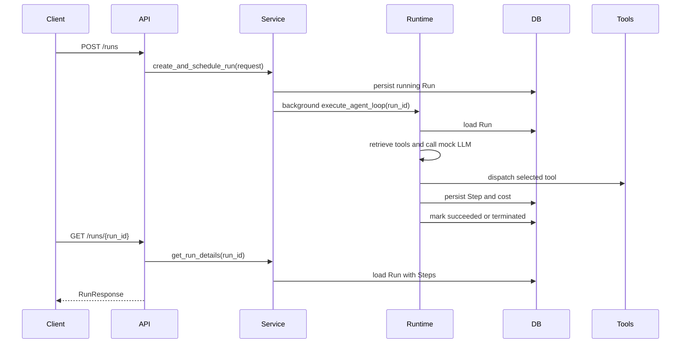

# AgentKit

Minimal agent-runtime service for the ExpandIQ technical assessment.

## Design observation

The hard part of a tool-calling agent runtime is not only choosing the next tool. It is making each decision bounded, replayable and inspectable. For that reason, this implementation treats every tool call, error, retry and guard outcome as persisted state rather than transient control flow hidden inside the loop.

## Features

- `POST /runs` creates a run and executes the deterministic agent loop in the background.
- `GET /runs/{run_id}` reads the persisted run, terminal reason, total cost and ordered steps.
- `GET /runs` lists recent runs with `limit` and `offset` pagination.
- Background run execution so clients can poll `GET /runs/{run_id}` while work is in flight.
- A ten-tool registry with `parallel_safe` and `idempotent` metadata.
- BM25-style top-K tool retrieval before each mock LLM call.
- Structured tool results and bounded retries for recoverable tool errors.
- Step cap, cost cap, stuck detection and timeout termination paths.
- Explicit unexpected-error termination with `reason="error"`.
- SQLite persistence through async SQLAlchemy.
- A Vite React frontend with goal input, polling, a timeline, final answer display and past runs.
- Application-specific exceptions and central logging configuration.

## Project Structure

```text
app/
  api/           FastAPI route handlers
  core/          Logging configuration
  database/      Async SQLAlchemy session setup
  entities/      SQLAlchemy ORM entities
  exceptions/    Application-specific exceptions
  llm/           Deterministic mock LLM, strategy registry and mock strategies
  mappers/       Entity-to-response mapping
  models/        Pydantic request and response models
  repositories/  SQLAlchemy persistence functions
  runtime/       Agent runtime guardrails
  services/      Run orchestration and agent runtime logic
  tools/         Tool definitions, metadata, retrieval and handlers
frontend/        Vite React single-page UI
tests/           API, runtime, guardrail and retrieval tests
```

## Request Flow



## Agent Contract

The agent accepts a goal and optional caps:

```json
{
  "goal": "Find the Q3 revenue summary",
  "max_steps": 20,
  "max_cost_usd": 0.5
}
```

The response contains persisted execution state rather than an in-memory trace:

- `status`: `running`, `succeeded` or `terminated`.
- `reason`: `succeeded`, `step_cap`, `cost_cap`, `stuck`, `timeout` or `error`.
- `steps`: ordered tool calls with arguments, structured results and per-step cost.
- `total_cost`: deterministic simulated cost accumulated across steps.

## Error Handling

- Missing run IDs raise `RunNotFoundError` in the service layer and are translated centrally to HTTP 404.
- Tool errors are represented as `ToolResult.error` so they appear in the persisted timeline.
- Recoverable tool errors are retried with a bounded retry loop.
- Semantic tool errors, such as a missing email idempotency key, are persisted and shown back to the mock LLM so it can correct course.
- Guard outcomes are normal agent terminal states, not Python exceptions.
- Unexpected runtime exceptions are logged and persisted as `status="terminated"`, `reason="error"`.

## Testing notes

- Manual scenario testing found that the `bad email Sunny` path originally hardcoded
  a different recipient in the mock LLM. This was fixed by deriving the recipient
  from the goal text, and a regression test now asserts the corrected recipient.
- Retrieval review found a weakness in plain keyword-overlap scoring: a tool with
  a noisy description could match several goal words and rank higher than a more
  appropriate tool. I replaced that with a dependency-free BM25-style ranker,
  which reduces this risk through inverse document frequency and length
  normalization while keeping retrieval deterministic.

## Known gaps

- The service is intentionally deterministic and uses canned tool outputs. There is no real LLM or external API integration because the assignment explicitly asks for a mock LLM.
- I chose SQLite for this prototype because it keeps reviewer setup simple and satisfies the persistence requirement without Docker or external services. SQLite tables are created at startup with SQLAlchemy metadata. In production, I would move run/step persistence to PostgreSQL or another managed relational database for stronger concurrency, indexing, backups, migrations and operational controls.
- The BM25-style retrieval approach is deterministic and explainable, but it is not a semantic embedding retriever.
- The frontend uses polling rather than streaming. Polling is sufficient for the required scope.
- The frontend uses semantic HTML, labels, focusable controls and visible state handling, but I did not add formal accessibility automation such as Axe or Lighthouse in this prototype.
- There is no auth, multi-tenant isolation, Docker setup or deployment pipeline because those are explicitly out of scope.

## Future enhancements

- API versioning: the service keeps the required `/runs` endpoints exactly as
  specified for the assessment. In a larger service, I would expose versioned
  routes such as `/api/v1/runs` to allow non-breaking API evolution.
- Observability: structured traces per run would make the agent loop easier to debug in production.
- Idempotency for `POST /runs` would be a useful stretch goal for replay protection.
- Hybrid tool retrieval: for a larger production registry, I would combine BM25 for exact keyword/tool-name matches with semantic embeddings for intent matching, then combine scores or ranks and evaluate tool-selection accuracy offline.
- Event-driven execution: `FastAPI BackgroundTasks` is enough for this prototype because each run is local, deterministic and small. In production, I would move agent execution to an event-driven worker architecture where `POST /runs` persists the run and publishes a `RunRequested` event to Kafka. Worker services would consume the event, execute the agent loop, persist step events and update run status. The frontend could continue polling or receive updates through SSE/WebSockets. Kafka would help scale workers horizontally, retry failed processing and decouple request handling from long-running agent execution.

## AI-Assist Log

I used Codex as a pair-programming assistant for planning, implementation, testing, refactoring and documentation. See [prompts/AI_ASSIST_LOG.md](prompts/AI_ASSIST_LOG.md) for the summarized prompt history, tool setup and ownership note.

## Clone

```bash
git clone https://github.com/Sunnyday16/expandiq-agentkit.git
cd expandiq-agentkit
git checkout feature/agentkit-runtime
```

## Run

```bash
uv sync
uv run uvicorn app.main:app --reload
```

In another terminal:

```bash
cd frontend
npm install
npm run dev
```

The frontend uses a Vite proxy. Browser requests to `/api/runs` are forwarded to the backend at `http://127.0.0.1:8000`.

FastAPI also exposes interactive API documentation automatically after the backend starts:

- Swagger UI: `http://127.0.0.1:8000/docs`
- OpenAPI JSON: `http://127.0.0.1:8000/openapi.json`
- ReDoc: `http://127.0.0.1:8000/redoc`

Logging defaults to `INFO` and records run creation, tool retrieval, tool dispatch, retries and terminal guard reasons. Set `LOG_FORMAT=json` for JSON logs.

## Test

```bash
uv run pytest
uv run ruff check .
uv run mypy app tests
cd frontend
npm run build
```

## Additional Report

See [REPORT.md](REPORT.md) for design rationale, scenario coverage, interpretation notes and AI-assist disclosure.
